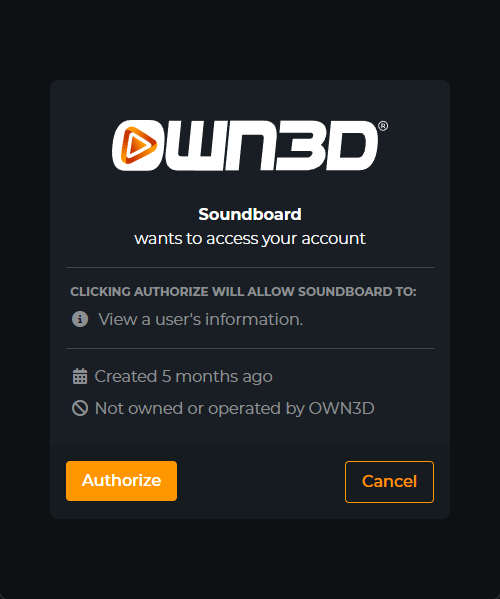

# Authorization

## What is OAuth2?

It is a standard protocol for allowing users to sign in to applications without requiring users to enter their
credentials. Many platforms like Google, Facebook, and GitHub use OAuth2.

### Terminology

- **Client**: The application that is requesting access to a user's data.
- **Authorization Code**: A code that is used to obtain an access token.
- **Access Token**: A user token that grants the application access to a user's data.
- **App Access Token**: A machine-to-machine app access token that is used to access the application's API.
- **Refresh Token**: A token that is used to obtain a new access token when the current one expires.
- **Scope**: The level of access that the application is requesting.
- **Redirect URI**: The URI that the application should redirect to after the user grants or denies access.

## Client Registration

To getting started, with our API's, you need to request a client id and client secret.
You can do this by fill out the [OAuth2 Client Registration](https://forms.gle/4miiLAksbFTEGg3c6) form with the
following information:

- Your application's name
- Your application's website
- Your application's description
- Your application's logo
- Your application's privacy policy
- Your application's terms of service
- Your application's redirect URI

## Types of Tokens

We currently support two types of tokens:

| Token Type        | Description                                                                                                                        |
|-------------------|------------------------------------------------------------------------------------------------------------------------------------|
| User Access Token | An access token that grants the application access to a user's data. You can use this token to access the user's data.             |
| App Access Token  | An access token that grants the application access to the application's API. Mostly intended for machine-to-machine communication. |

User Access Tokens and App Access Tokens are both bearer tokens. Bearer tokens are used to authenticate the application.

## Authorization Code Flow

### Authorization Code Flow Overview

1. The client sends a request to the authorization server asking for an authorization code.
2. The authorization server authenticates the client and issues an authorization code.
3. The client redirects the user back to the application with the authorization code.
4. The application exchanges the authorization code for an access token.

### Authorization Code Flow Example

In the following example, we will use the authorization code flow to get an access token.
To visualize the flow, we will use javascript to redirect the user to the authorization server. You will find your
client id in the [Passport Client](https://console.dev.own3d.tv/resources/passport-clients) section of the OWN3D
Developer Console.

::: tip
Ensure that you have added the redirect URI to
your [Passport Client](https://console.dev.own3d.tv/resources/passport-clients) in the OWN3D Developer Console.
Otherwise, the authorization server will throw a "**Client authentication failed**" error.
:::

```javascript
// Redirect the user to the authorization server
window.location.href = "https://id.stream.tv/oauth/authorize?client_id=<>&redirect_uri=<>&response_type=code&scope=<>";
```

The user will then be redirected to the application with the authorization code in the URL. From there, the user must
click on the "Authorize" button to grant the application access to the user's data:

<div style="text-align: center">

</div>

After that we use php to get the access token from the authorization server.

```php
// Get the authorization code from the URL
$code = $_GET['code'];
// Exchange the authorization code for an access token using laravel http facades
$response = \Http::post('https://id.stream.tv/oauth/token', [
    'client_id' => '<>',
    'client_secret' => '<>',
    'redirect_uri' => '<>',
    'code' => $code,
    'grant_type' => 'authorization_code',
]);
// Get the access token from the response
$access_token = $response->json()['access_token'];
```

If you are familiar with laravel, you may want to check our [own3d/id](https://github.com/own3d/id) package.
It is a laravel package that provides a simple way to work with our API's.

## Refresh Tokens

Refresh tokens are used to obtain a new access token when the current one expires.
With the following example, we will use the refresh token flow to get a new access token.

```php
// Get the refresh token from the response
$refresh_token = $response->json()['refresh_token'];
// Exchange the refresh token for a new access token
$response = \Http::post('https://id.stream.tv/oauth/token', [
    'client_id' => '<>',
    'client_secret' => '<>',
    'redirect_uri' => '<>',
    'refresh_token' => $refresh_token,
    'grant_type' => 'refresh_token',
]);
// Get the access token from the response
$access_token = $response->json()['access_token'];
```

## Token Expiration

Typically, the `/oauth/token` endpoint will return a `expires_in` field that indicates the number of seconds until the
token expires.

By default, access tokens expire after 15 days and refresh tokens after 30 days.
This means after expiration of the access token, you will need to use the refresh token within 15 days to get a new
access token.
If you don't use the refresh token within 30 days, the user will be required to re-authenticate.

Personal access tokens having a lifetime of 6 months. These tokens cannot be refreshed automatically.

## Scopes

With Scope, you can specify the level of access that the application is requesting.
We currently support the following scopes:

| Scope                       | Description                                                                    |
|-----------------------------|--------------------------------------------------------------------------------|
| `academy:read`              | Allows the application to read academy data.                                   |
| `academy:manage`            | Allows the application to manage academy data.                                 |
| `alerts:manage`             | Allows the application to manage alerts.                                       |
| `affiliate:manage`          | Allows the application to manage affiliate links.                              |
| `analytics:read`            | Allows the application to read analytics data.                                 |
| `chatbot:read`              | Allows the application to read chatbot data.                                   |
| `chatbot:manage`            | Allows the application to manage chatbot data.                                 |
| `chatbot:manage:commands`   | Allows the application to manage chatbot commands.                             |
| `chatbot:manage:moderation` | Allows the application to manage chatbot moderation.                           |
| `chatbot:manage:timers`     | Allows the application to manage chatbot timers.                               |
| `chatbot:manage:giveaways`  | Allows the application to manage chatbot giveaways.                            |
| `connections`               | Allows the application to manage social media connections.                     |
| `donations:read`            | Allows the application to read donations data.                                 |
| `donations:manage`          | Allows the application to manage donations data.                               |
| `entitlements:read`         | Allows the application to read entitlements data aka. purchased products.      |
| `extensions:read`           | Allows the application to read extensions data.                                |
| `extensions:manage`         | Allows the application to manage extensions data, like changing configuration. |
| `linkspree:manage`          | Allows the application to manage linkspree links.                              |
| `orders:manage`             | Allows the application to manage orders data.                                  |
| `subscription:read`         | Allows the application to read subscription data.                              |
| `user:read`                 | Allows the application to read user data.                                      |
| `user:manage`               | Allows the application to manage user data.                                    |
| `user:manage:credentials`   | Allows the application to manage user credentials.                             |
| `widgets:manage`            | Allows the application to manage widgets data.                                 |

You will also find all scopes in our [Scope](https://github.com/own3d/id/blob/master/src/Enums/Scope.php) Enum in
GitHub.
