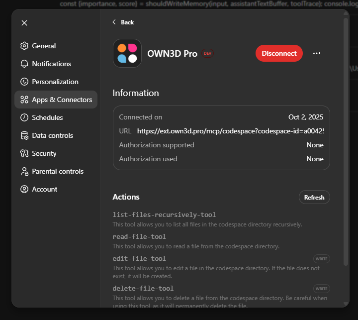

# OWN3D Codespaces

## Overview

**OWN3D Codespaces** are cloud-based development environments designed specifically for creating and managing **OWN3D
Extensions**.
They work similarly to GitHub Codespaces but are fully integrated into the **OWN3D ecosystem**, offering a ready-to-use,
secure, and optimized workspace for streamers and extension developers.

The main goal is to help streamers and developers get started faster — with zero local setup — by providing
preconfigured environments, tools, and APIs tailored to the OWN3D platform.

## Vision & Current Focus

Our vision is to make developing OWN3D Extensions as simple as opening your editor.
Currently, the focus lies on integrating **API** and **MCP (Model Context Protocol)** tools to streamline how extensions
interact with AI-powered tools such as **PhpStorm**, **ChatGPT**, and other supported IDEs or assistants.

As the platform evolves, more integrated workflows, real-time collaboration, and deployment features will be added to
make extension development fully seamless.

## Next Steps

* TODO

---

# Model Context Protocol

## What is the OWN3D Codespace MCP Server (Beta)?

The **OWN3D Codespace MCP Server** is a bridge between your **OWN3D Extensions** and AI-assisted development tools such
as **ChatGPT**, **Claude**, or **PhpStorm**.
It enables these tools to directly interact with your Codespace — reading files, running scripts, managing
configurations, or triggering OWN3D-specific actions — all through a unified and secure interface.

By exposing your Codespace as an **MCP endpoint**, AI-powered tools gain project-level context and can assist you in
coding, debugging, and testing your OWN3D Extensions more intelligently.

The server runs in the **OWN3D Cloud** and is accessible via:

::: warning
You need an access token with the `mcp:use` scope to use the MCP Server!
:::

```
https://ext.own3d.pro/v1/mcp/codespaces
```

---

### Configure within Developer Tools

You can configure your IDE or other MCP-compatible tools to connect directly to your OWN3D Codespace.
The example below shows a sample configuration for **VS Code**:

```json
{
  "servers": {
    "own3d": {
      "type": "http",
      "url": "https://ext.own3d.pro/v1/mcp/codespaces",
      "headers": {
        "X-OWN3D-Codespace-Id": "<your-codespace-id>",
        "Authorization": "Bearer <your-api-token>"
      }
    }
  }
}
```

Make sure to replace `<your-codespace-id>` and `<your-api-token>` with your actual credentials from the OWN3D Developer
Dashboard.

### Configure within ChatGPT

You can also connect your Codespace directly to **ChatGPT** through its MCP settings.
This enables ChatGPT to access your extension project context and assist with development tasks.



### Configure within Agents SDK

You can also connect your Codespace directly with the Agents SDK through its Hosted MCP server tools.

```typescript
import {Agent, hostedMcpTool} from '@openai/agents';

export const agent = new Agent({
    name: 'MCP Assistant',
    instructions: 'You must always use the MCP tools to answer questions.',
    tools: [
        hostedMcpTool({
            serverLabel: 'own3d_codespaces',
            serverUrl: 'https://ext.own3d.pro/v1/mcp/codespaces',
            headers: {
                'X-OWN3D-Codespace-Id': '<your-codespace-id>',
                'Authorization': 'Bearer <your-api-token>'
            },
        }),
    ],
});
```

## Tools

These tools are available within your **OWN3D Codespace** to help you manage files, content, and deployments directly
through the MCP interface or API.

### list-files-recursively-tool

Lists all files in your extension’s workspace directory **recursively**.
Useful for exploring the full file structure of your project.

### read-file-tool

Reads the contents of a specific file within your workspace directory.
Ideal for retrieving code snippets, or configuration files.

### edit-file-tool

Creates or modifies a file within your workspace directory.
If the specified file does not exist, it will be **automatically created**.

### delete-file-tool

Deletes a file from your workspace directory.
Use with care — deleted files cannot be recovered.

### deploy-codespace-tool

Deploys your extension to the **OWN3D CDN**, making it available for testing or preview.
This tool handles packaging and upload automatically, so you can focus on development instead of manual deployment
steps.

# Codespace API Reference

## Codespaces

### Create a AI Codespace

Creates a new AI extension with a codespace from the [own3d/widget-template](https://github.com/own3d/widget-template)
Git repository. This extension will be automatically marked as Codespace & AI widget.

- **Endpoint:** `POST /v1/codespaces`
- **Permission:** `codespaces:manage`

#### Body

| Name             | Type   | Description                              |
|------------------|--------|------------------------------------------|
| `name`           | string | The name of your extension.              |
| `repository_url` | string | The URL of the Git repository.           |
| `user_id`        | string | Your user ID.                            |
| `password`       | string | The password for creating the codespace. |

#### Example Request

```bash
curl -X POST https://ext.own3d.pro/v1/codespaces/ai \
  -H "Authorization: Bearer <YOUR_TOKEN>" \
  -H "Content-Type: application/json" \
  -d '{
    "name": "My Awesome Extension",
    "repository_url": "https://github.com/user/repo.git",
    "user_id": "12345", // will be removed in final release
    "password": "your_password" // will be remove in final release
  }'
```

### Create a Vanilla Codespace

Creates a new extension with a codespace from a Git repository.

- **Endpoint:** `POST /v1/codespaces`
- **Permission:** `codespaces:manage`

#### Body

| Name             | Type   | Description                              |
|------------------|--------|------------------------------------------|
| `name`           | string | The name of your extension.              |
| `repository_url` | string | The URL of the Git repository.           |
| `user_id`        | string | Your user ID.                            |
| `password`       | string | The password for creating the codespace. |

#### Example Request

```bash
curl -X POST https://ext.own3d.pro/v1/codespaces/ai \
  -H "Authorization: Bearer <YOUR_TOKEN>" \
  -H "Content-Type: application/json" \
  -d '{
    "name": "My Awesome Extension",
    "repository_url": "https://github.com/user/repo.git",
    "user_id": "12345", // will be removed in final release
    "password": "your_password" // will be remove in final release
  }'
```

---

## Filesystem

### Get File Tree

Retrieves the entire file and directory structure of a codespace.

- **Endpoint:** `GET /v1/codespaces/{codespace_id}/fs/tree`
- **Permission:** `codespaces:manage`

#### Example Request

```bash
curl -X GET https://ext.own3d.pro/v1/codespaces/abc-123/fs/tree \
  -H "Authorization: Bearer <YOUR_TOKEN>"
```

### List Files and Directories

Lists the contents of a specific directory within a codespace.

- **Endpoint:** `GET /v1/codespaces/{codespace_id}/fs/ls`
- **Permission:** `codespaces:manage`

#### Query Parameters

| Name   | Type   | Description                        |
|--------|--------|------------------------------------|
| `path` | string | The path of the directory to list. |

#### Example Request

```bash
curl -X GET "https://ext.own3d.pro/v1/codespaces/abc-123/fs/ls?path=/src/components" \
  -H "Authorization: Bearer <YOUR_TOKEN>"
```

### Read a File

Reads the contents of a specific file within a codespace.

- **Endpoint:** `GET /v1/codespaces/{codespace_id}/fs/file`
- **Permission:** `codespaces:manage`

#### Query Parameters

| Name   | Type   | Description                   |
|--------|--------|-------------------------------|
| `path` | string | The path of the file to read. |

#### Example Request

```bash
curl -X GET "https://ext.own3d.pro/v1/codespaces/abc-123/fs/file?path=/src/index.js" \
  -H "Authorization: Bearer <YOUR_TOKEN>"
```

### Write a File

Creates a new file or updates an existing one within a codespace.

- **Endpoint:** `POST /v1/codespaces/{codespace_id}/fs/file`
- **Permission:** `codespaces:manage`

#### Body (multipart/form-data)

| Name   | Type   | Description                              |
|--------|--------|------------------------------------------|
| `path` | string | The path where the file should be saved. |
| `file` | file   | The file to upload.                      |

#### Example Request

```bash
curl -X POST https://ext.own3d.pro/v1/codespaces/abc-123/fs/file \
  -H "Authorization: Bearer <YOUR_TOKEN>" \
  -F "path=/src/new-file.js" \
  -F "file=@/path/to/your/local/file.js"
```

### Delete a File

Deletes a file from a codespace.

- **Endpoint:** `DELETE /v1/codespaces/{codespace_id}/fs/rm`
- **Permission:** `codespaces:manage`

#### Body

| Name   | Type   | Description                     |
|--------|--------|---------------------------------|
| `path` | string | The path of the file to delete. |

#### Example Request

```bash
curl -X DELETE https://ext.own3d.pro/v1/codespaces/abc-123/fs/rm \
  -H "Authorization: Bearer <YOUR_TOKEN>" \
  -H "Content-Type: application/json" \
  -d '{
    "path": "/src/obsolete-file.js"
  }'
```

### Reset Filesystem

Resets the codespace's filesystem to match the state of the linked Git repository. All local changes will be lost.

- **Endpoint:** `POST /v1/codespaces/{codespace_id}/fs/reset`
- **Permission:** `codespaces:manage`

#### Example Request

```bash
curl -X POST https://ext.own3d.pro/v1/codespaces/abc-123/fs/reset \
  -H "Authorization: Bearer <YOUR_TOKEN>"
```

### Sync Filesystem

Deploys the current state of the codespace's filesystem to the extension hosting CDN.

- **Endpoint:** `POST /v1/codespaces/{codespace_id}/fs/sync`
- **Permission:** `codespaces:manage`

#### Example Request

```bash
curl -X POST https://ext.own3d.pro/v1/codespaces/abc-123/fs/sync \
  -H "Authorization: Bearer <YOUR_TOKEN>"
```

