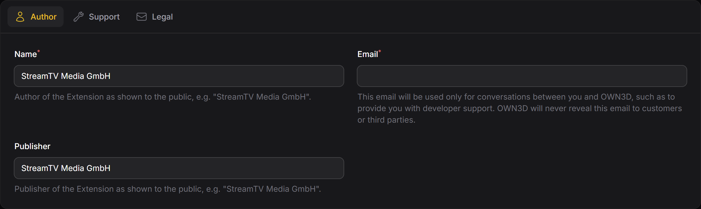
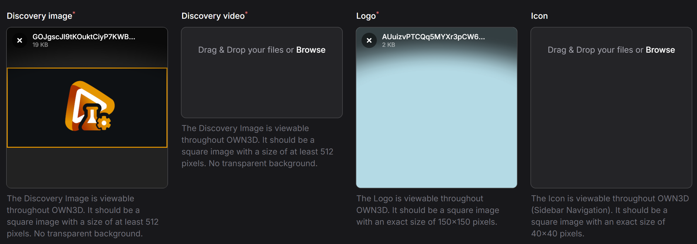
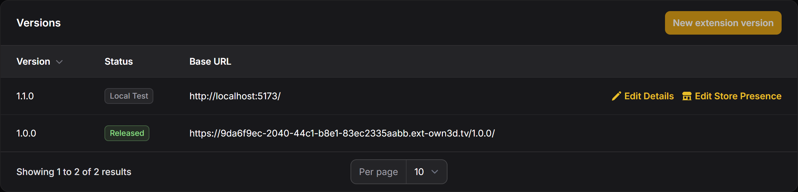
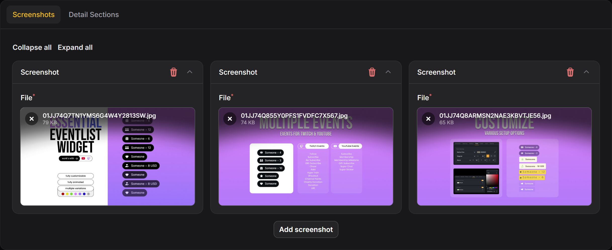
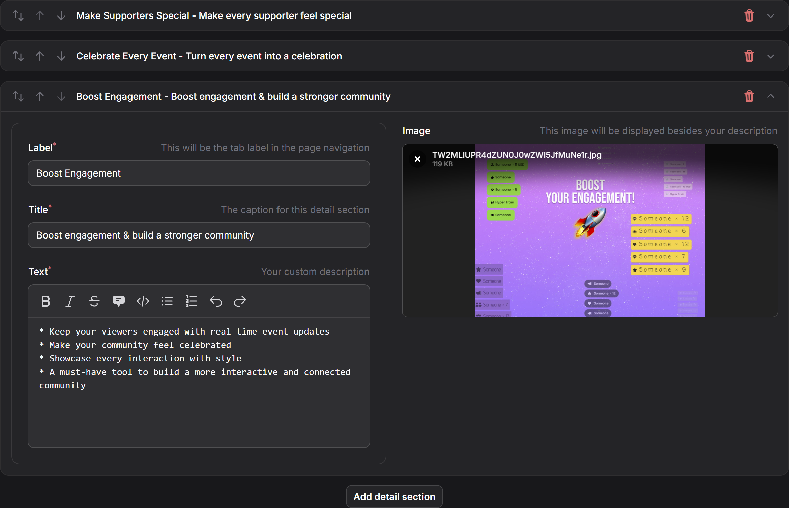
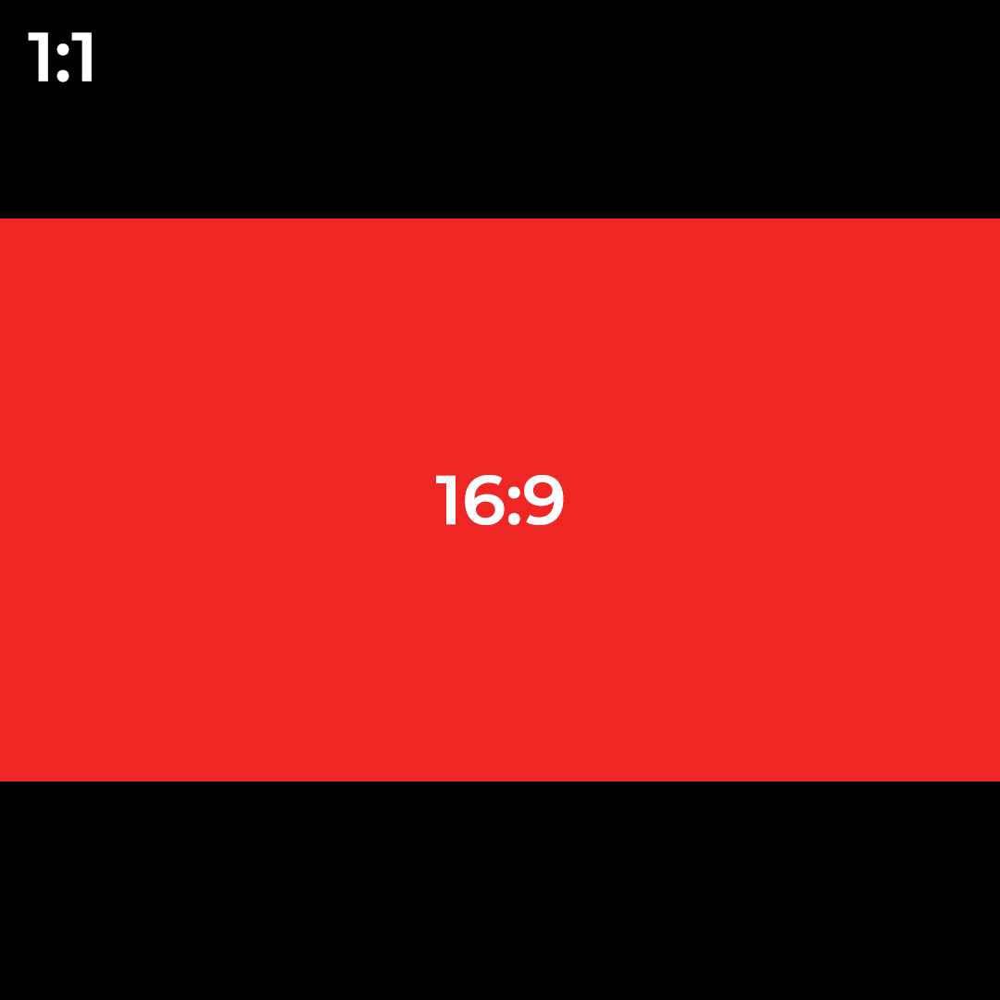
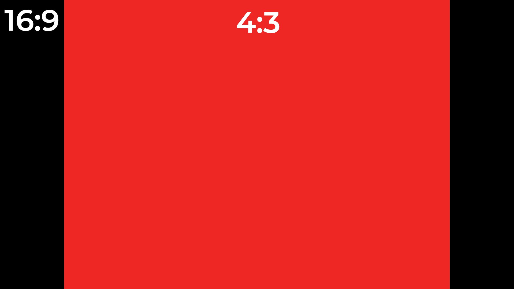
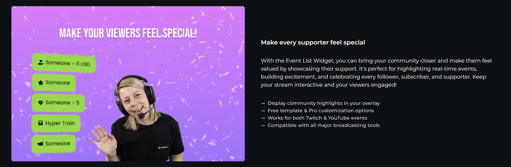

# Getting Started <Badge text="public beta" type="warning"/>

## What is an Extension?

Extensions are hosted html, css and javascript files, small applications, which are hosted by our content delivery
network. They allow streamers to add functionality to their OWN3D Pro Dashboard, Scene Editor, and OBS Studio
installation. The backend must be hosted by the extension author themselves.


## Types of Extensions

There are two main use-case types of extensions:

### Dashboard Extensions

With dashboard extensions, you can add new features to the OWN3D Pro Dashboard, like a new widget or a new page allowing
the streamer to extend the functionality of the dashboard with your own features.

### Scene Editor Widget Extensions

With scene editor widget extensions, you can add new widgets to the OWN3D Pro Scene Editor. This can be something like
a real-time heart rate monitor or informative widgets like a leaderboard, donation goal, or a chat.

These widgets can also be added to the OBS Studio installation using browser sources.

## Compatibilities

Extensions support different compatibilities. Each compatibility represents a "feature" of the extension. For example,
a compatibility can be a "**browser-source**" or "**standalone**", which allows the extension to be used as Scene Editor
Widget or as a Standalone App in the OWN3D Pro Dashboard.

You can also add additional compatibilities to your extension, like "**config**", which allows you to add a
configuration page to your extension details page allowing the streamer to configure your extension.

Here is a list of all supported compatibilities:

| ID | Name                          | Description                                                                                                                                         |
|----|-------------------------------|-----------------------------------------------------------------------------------------------------------------------------------------------------|
| 2  | Standalone Extension          |  The `standalone` compatibility allows the extension to be used as a Standalone App in the OWN3D Pro Dashboard.                                     |
| 4  | Scene Editor Widget Extension | The `browser-source` compatibility allows the extension to be used as a Scene Editor Widget.                                                        |
| 5  | Configuration Page            | The `config` compatibility allows you to add a configuration page to your extension details page allowing the streamer to configure your extension. |

Other compatibilities are planned for the future.


## Create your first Extension

The following guide will help you to create your first extension, test it, and publish it to the public. You can create
your own extensions using our [Developer Console](https://console.dev.own3d.tv).


To assist you in getting started, we've developed a fundamental boilerplate extension that serves as a starting point
for your own extensions. It demonstrates how to use the API and communicate with the backend, and how to construct and
package your extension.

### Step 1: Checkout our example extension

Clone our example extension from [GitHub](https://github.com/own3d/extension-boilerplate) and start editing the files.

The entrypoint of the extension is the `index.html` file.

### Step 2: Create a new extension

To create a new extension, you need to log in to the [developer portal](https://console.dev.own3d.tv/) and create a new
extension.


After filling out and submitting the form, OWN3D will create a new **Extension** & **Extension Version** (1.0.0) for
you. This Extension Version will be in the [Local Test](live-circle.md) state by default.

### Step 3: Add Internal Testers

Within your **Extension Version**, you can add up to 10 internal testers to your extension. These testers can be added
using the [Access Control](access-control.md) settings. You can add them by their ID or username.


### Step 4: Define your Compatibilities & Test your Extension

Still in your **Extension Version**, you can define the compatibilities of your extension. You can add multiple
compatibilities to your extension, like `browser-source` or `standalone`. **Without this step, your will not be able to
locate your extension in the OWN3D Pro Dashboard or Scene Editor.**

Inside your compatibility settings you can define the following:

- **Path**: The relative path to your extension's entrypoint (e.g. `index.html`).

::: tip
Because our CDN serves your extension files inside a version subdirectory  
(e.g. [https://extension-id.ext-own3d.tv/1.0.0/index.html](https://www.youtube.com/watch?v=dQw4w9WgXcQ)), you will need
to set your base path in your Vite, React or Vue configuration to be relative to `./` before building your extension.

For Vite, this would look like this:

```js
// https://vitejs.dev/config/
export default defineConfig({
    base: './', // or explicit /1.0.0/ (depending on your version)
    plugins: [vue()],
})
```
:::

For Scene Editor Widgets, you can define additional settings:

- **Sizing**: The initial dimension and position of your widget (e.g. `300x300`).
- **[Forms](syntax-for-forms.md)**: The form fields of your widget (e.g. `input`, `color`, `font-settings`).

After defining your compatibilities, you will find **Internal Test URL's** for your extension. You can use these URL's
to test your extension in the OWN3D Pro Dashboard.


::: warning
To test any widget extension, simply open our Scene Builder and add your extension as a new widget found in the
**Extensions (Invite Only)** tab. You need to be a member of the internal testers to see your extension there.

**Widgets added to your Scene Builder via this tab will be locked to the selected version and will not be updated
automatically, even if you publish a new version!**


:::

### Step 5: Upload it to our CDN

::: tip
You don't need to upload your extension to our CDN during development. You can use a local webserver with HTTPS
support to test your extension. You can use [ngrok](https://ngrok.com/) to create a secure tunnel to your local
webserver too.
:::

If you're done with the extension, you can upload it to our CDN using
the [developer portal](https://console.dev.own3d.tv/).

Within the developer portal, you can customize your extension's settings, such as the name, description, as well
as the hosting endpoints for the widget, dashboard, and configuration page.

### Step 6: Update your extension details and presence

When the development of your extension is finished and you are ready to submit it for review, take some time and add
some details and screenshots. This is required to be finished before submitting for review, as editing this information
is not available after this step.

#### Basic information

We highly recommend to give your extension a clear and unique name, as well as a good description.
This information is used for searching in our store, so a fitting description helps with discoverability of your extension. A fitting extension category will get you listed in corresponding category pages.


#### Contact information

Providing contact information is required to give us and the users a way to contact you in case of questions or
issues. Some of this information is optional, as it might not be required in certain cases, but we will let you
know, if required information is missing for your specific extension.



#### Images and videos

When submitting an extension, we require at least a discovery image and a logo to be uploaded. The discovery
image will be visible in the store search, while the logo may appear in places, where less space is available.

Uploading a discovery video and icon is optional, but is highly recommended. The video will be playing when hovering
over your extension in search results and makes it more lively. The icon is especially useful for dashboard extensions,
as those can be displayed in the dashboard sidebar.

For supported formats and recommended layout techniques, please refer to the respective [section](#media-formats) below.



#### Version details

The individual versions contain information separate from the main extension. This includes information about
premium features that can be unlocked via purchases or a OWN3D.PRO subscription.



#### Screenshots

Apart from using your discovery image and video, you are also able to upload screenshots, that will be displayed
in a gallery on your extension's detail page.

For supported formats and recommended layout techniques, please refer to the respective [section](#media-formats) below.



#### Detail sections

Ever dreamed of a full store presence without the hassle of building a custom layout? We got you! By using our
system for "detail sections", you are able to define an arbitrary amount of sections that are displayed below your
image gallery on the detail page.

All fields are required when it comes to the review process. The label is used as a tab in the header for immediate
navigation to your presented features, while the title and text are rendered in a way that fits our store design.
Every other section flips the text and media to provide an alternating visual.

For supported formats and recommended layout techniques, please refer to the respective [section](#media-formats) below.



### Step 7: Review and publish it

After pushing your extension in a hosted-test state, you can use it in your OWN3D Pro dashboard. There you can test all
the features of your extension. If you want to publish your extension to the public, you need to submit your extension
for a code and feature review.

## Media formats

### Discovery images

Discovery images are required to be in a square format to fit our tile-based search in the store. We recommend to 
limit your main content to a contained 16:9 area, as we might re-use this image in other places as well.

The file dimensions are required to be 1080px in both directions.



### Discovery videos

Discovery videos are required to be in a 16:9 format to fit our hover preview in the store. We recommend to limit
your main content to a contained 4:3 area, as we will also display the video in the gallery slider on the detail
page.

The file dimensions are required to be 1280x720.



### Logos and icons

Logos and icons are required to be in a square format.

The file dimensions must be 150px in both directions for logos and 40px for icons.

### Detail sections

Detail sections are required to be in a 4:3 format to fit our layout.

The file dimensions are required to be 1080x810.



## Debugging

### Development Tools & Feature Flags

::: danger
**This tool is really for debugging purposes only!** It is not recommended to use it in a production environment, as
some features may break or not work as expected.
:::

To enable the values' inspector, call the following method in your browser console:

```text
localStorage.setItem('devtools', true)
Press: Ctrl+Shift+F
```


Then enable the **Show Values Inspector** feature flag in the developer console. This will show you the values of the
form fields of any widget inside the Scene Builder.


