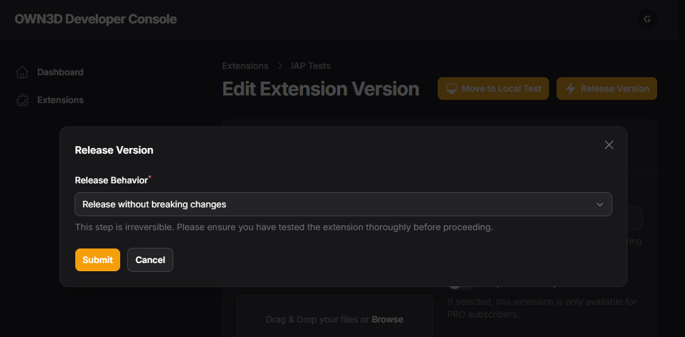

# Life Cycle Management

Each extension version goes through a release circle. The release circle is a process that ensures that each extension
version is reviewed and tested before it is published to the public. For now, you can only publish one version of your
extension at a time. Each new release will deprecate the previous version.

> During **Local Test** & **Hosted Test** you can select to **up to 10 [Internal Tester](#access-control) accounts** (by
> ID or username) to make your app available for internal testing releases.

## Local Test

Each version begins with the local test state. In this state, you can test your extension locally without uploading it
to our CDN. You can use a local webserver with HTTPS support to test your extension.

## Hosted Test

In the hosted test state, your extension is hosted on our CDN. In this state, you can test your extension how it will
behave in the production environment and make sure that everything works as expected before submitting it for a code
and feature review.

## In Review

In the review state, your extension is reviewed by our team. We check if your extension follows our guidelines and
works as expected. If your extension is rejected, you can fix the issues and resubmit it for a review.

## Rejected

If your extension is rejected, you can fix the issues and resubmit it for a review. You must move your extension back
to the local test state before you can resubmit it for a second review.

## Approved

If your extension is approved, you can publish it to the public.

### Release your extension

To release your extension, you need to select the version you want to publish and click on the **Release** button. This
will publish your extension to the public.

**Release Behavior**

When you release your extension, you will be asked to select the release behavior. You can choose between

- **Release without breaking changes**: This will publish your extension to all users immediately.
- **Breaking Change → Shutdown old widgets → Notify users**: This will publish your extension to all users immediately
  and shut down all old widgets. This is useful if you have made breaking changes to your extension and want to make
  sure that all users are using the latest version. It requires the user to reconfigure the extension in their scene
  builder.
- **Breaking Change → Keep widgets**: This will publish your extension to all users immediately and keep all old
  widgets. This is useful if you have made breaking changes to your extension but want to make sure that existing users
  can still use the old version of your extension. It still requires the user to reconfigure the extension in their
  scene builder.

By default, we recommend using **Release without breaking changes**. But if you work with widgets that are not
compatible with the new schema of your forms, you should use **Breaking Change → ...**, and select the option that fits
your needs.

> **Note**: If you select the **Breaking Change → Shutdown old widgets → Notify users** option, all users will be
> notified about the breaking change.

## Published

If your extension is published, it is available to all or selected OWN3D users depending on
your [Content Creator Allowlist](#access-control) settings.

## Deprecated

If you publish a new version of your extension, the previous version will be deprecated.
You can roll back/restore a deprecated version of your extension at any time but not later than 30 days after the
deprecation.