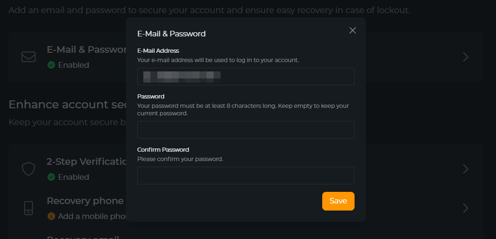

# Account Security

Over the past few years, we have seen an increase in the number of security breaches and data leaks. As a result, it is
more important than ever to take steps to protect your account from unauthorized access. In this guide, we will cover
some of the best practices for securing your account.

## E-Mail & Password

In most cases, you will sign in to OWN3D services using your streaming service account (e.g. Twitch or YouTube).
However,
if you plan to unlink all your streaming service accounts from your OWN3D account, you will need to set a password for
your OWN3D account.

To set a password for your OWN3D account, follow these steps:

1. Go to the [OWN3D Accounts website](https://id.stream.tv/) and log in.
2. Click on the "[Security](https://id.stream.tv/security)" tab.
3. Click on the "**E-Mail & Password**" section.
4. Enter your new password and confirm it.
5. Click on the "**Save**" button.
6. Done!

### When do I require a password?

- When do you want to have additional security for your OWN3D account.
- When you want to unlink all your streaming service accounts from your OWN3D account:

### Is my password secure?

When setting a password for your OWN3D account, make sure to use a strong password that is difficult to guess. Here are
some tips for creating a secure password:

- Use a combination of letters, numbers, and special characters.
- Avoid using common words or phrases.
- Do not use the same password for multiple accounts.

**OWN3D WILL NEVER ASK YOU FOR YOUR PASSWORD!** If you receive an email or message asking for your password, do not
respond and report it to us immediately.

## 2-Step Verification

::: warning
We will enforce 2-Step Verification enabled for Staff accounts on 1st of January 2025.
:::

A YubiKey is a hardware security key that provides an additional layer of security to your account. It is a physical
device that you can use to generate a one-time password (OTP) that you can use to log in to your account. This is a
great way to protect your account from unauthorized access.

### Register a YubiKey

Adding a YubiKey to your account is easy. Here's how you can do it:

1. Go to the [YubiKey website](https://www.yubico.com/products/yubico-authenticator/) and purchase a YubiKey.
2. Go to the [OWN3D Accounts website](https://id.stream.tv/) and log in.
3. Click on the "[Security](https://id.stream.tv/security)" tab.
4. Click on the "**2-Step Verification**" section.
5. You will be asked to generate a "**One Time Password**" (OTP) with your YubiKey.
6. Insert your YubiKey into your computer and press the button on the YubiKey.
7. The OTP will be generated, and you can now use it to register your YubiKey.
8. Click on the "**Register YubiKey**" button.
9. Done!

### Remove a YubiKey

Removing a YubiKey from your account is easy. Here's how you can do it:

1. Go to the [OWN3D Accounts website](https://id.stream.tv/) and log in.
2. Click on the "[Security](https://id.stream.tv/security)" tab.
3. Click on the "**2-Step Verification**" section.
4. Select the YubiKey you want to remove.
5. Click on the "**Remove**" button.
6. Done!

## Recovery phone

In development.

## Recovery email

In development.

## Backup codes

In development.