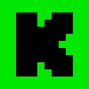

# Event Types

#### Understanding Event Types in NotifySub

NotifySub supports multiple event types, which may or may not be available across different platforms. When event types
are added in NotifySub, their names are typically based on commonly used terms like “follow” and “subscribe,” reflecting
how these actions are understood across most platforms. For example, while YouTube uses the term “subscribe” in a
non-monetary context, NotifySub aligns “subscribe” with its usual meaning on other platforms, where it often implies a
monetary action (like a membership). This approach ensures consistency and clarity, even when platform-specific terms
differ.

#### Notification Payload Structure

All event types in NotifySub follow a standardized structure, as shown below:

```json
{
  "subscription": {
    "type": "<event_type>",
    "version": "<version>",
    "condition": {
      "platform": "<platform>",
      "platform_id": "<platform_id>"
    }
  },
  "notification": {
    "id": "<notification_id>",
    "created_at": "<timestamp>"
  },
  "event": <payload>
}
```

The `condition` section should match what you used when subscribing to that event type.

To receive these notifications, you need to subscribe to the event types you are interested in, check out
the [Socket API documentation](../alerts/examples.md#socket-api) for more information.

## Stream Online
<div style="display: flex; gap: 0.2rem; margin-top: 0.2rem">
  
  
</div>

This notification is sent, when a user starts a broadcast on a connected platform.

```json
{
  "subscription": {
    "type": "stream.online",
    "version": "1",
    "condition": {
      "platform": "<platform>",
      "platform_id": "<platform_id>"
    }
  },
  "notification": {
    "id": "<notification_id>",
    "created_at": "<timestamp>"
  },
  "event": []
}
```

#### Related platform events

| Platform | Platform event  |
|----------|-----------------|
| Twitch   | `stream.online` |
| YouTube  | PubSubHubBub    |

## Stream Offline
<div style="display: flex; gap: 0.2rem; margin-top: 0.2rem">
  
  
</div>

This notification is sent, when a user ends a broadcast on a connected platform.

```json
{
  "subscription": {
    "type": "stream.offline",
    "version": "1",
    "condition": {
      "platform": "<platform>",
      "platform_id": "<platform_id>"
    }
  },
  "notification": {
    "id": "<notification_id>",
    "created_at": "<timestamp>"
  },
  "event": []
}
```

#### Related platform events

| Platform | Platform event                       |
|----------|--------------------------------------|
| Twitch   | `stream.offline`                     |
| YouTube  | Chatbot can not find a chat instance |

## Update
<div style="display: flex; gap: 0.2rem; margin-top: 0.2rem">
  
</div>

This notification is sent, when a user updates their channel information.

```json
{
  "subscription": {
    "type": "update",
    "version": "1",
    "condition": {
      "platform": "<platform>",
      "platform_id": "<platform_id>"
    }
  },
  "notification": {
    "id": "<notification_id>",
    "created_at": "<timestamp>"
  },
  "event": []
}
```

#### Related platform events

| Platform | Platform event   |
|----------|------------------|
| Twitch   | `channel.update` |

## Follow
<div style="display: flex; gap: 0.2rem; margin-top: 0.2rem">
  
  
  
</div>

This notification is sent, when a viewer "follows" a user channel. We define "follow" as non-monetary, which means that
a "follow" is in fact a "subscription" on YouTube.

```json
{
  "subscription": {
    "type": "follow",
    "version": "1",
    "condition": {
      "platform": "<platform>",
      "platform_id": "<platform_id>"
    }
  },
  "notification": {
    "id": "<notification_id>",
    "created_at": "<timestamp>"
  },
  "event": {
    "name": "Someone"
  }
}
```

#### Related platform events

| Platform | Platform event     |
|----------|--------------------|
| Twitch   | `channel.follow`   |
| YouTube  | Repeated API fetch |
| Kick     | `channel.follow`   |

## Subscribe
<div style="display: flex; gap: 0.2rem; margin-top: 0.2rem">
  
  
  
</div>

This notification is sent, when a viewer "subscribes" to a user channel. We define "subscribe" as monetary, which means
a "subscription" is in fact a "membership" on YouTube.

```json
{
  "subscription": {
    "type": "subscribe",
    "version": "1",
    "condition": {
      "platform": "<platform>",
      "platform_id": "<platform_id>"
    }
  },
  "notification": {
    "id": "<notification_id>",
    "created_at": "<timestamp>"
  },
  "event": {
    "name": "Someone",
    "tier": "1000",
    "is_gift": false
  }
}
```

#### Related platform events

| Platform | Platform event             |
|----------|----------------------------|
| Twitch   | `channel.subscribe`        |
| YouTube  | Membership message in chat |
| Kick     | `channel.subscription.new` |

## Re-Subscribe
<div style="display: flex; gap: 0.2rem; margin-top: 0.2rem">
  
  
  
</div>

This notification is sent, when a viewer continues a subscription / membership on a user channel.

```json
{
  "subscription": {
    "type": "re-subscribe",
    "version": "1",
    "condition": {
      "platform": "<platform>",
      "platform_id": "<platform_id>"
    }
  },
  "notification": {
    "id": "<notification_id>",
    "created_at": "<timestamp>"
  },
  "event": {
    "name": "Someone",
    "message": "Message text",
    "emotes": [],
    "tier": "1000",
    "months": 5,
    "streak": 3,
    "duration": 1
  }
}
```

#### Related platform events

| Platform | Platform event                 |
|----------|--------------------------------|
| Twitch   | `channel.subscription.message` |
| YouTube  | Membership milestone in chat   |
| Kick     | `channel.subscription.renewal` |

## Gift-Subscribe
<div style="display: flex; gap: 0.2rem; margin-top: 0.2rem">
  
  
  
</div>

This notification is sent, when a viewer gifts one or more subscriptions / memberships to the community. There will
usually be multiple `subscribe` notifications afterwards coming from the platform.

```json
{
  "subscription": {
    "type": "gift-subscribe",
    "version": "1",
    "condition": {
      "platform": "<platform>",
      "platform_id": "<platform_id>"
    }
  },
  "notification": {
    "id": "<notification_id>",
    "created_at": "<timestamp>"
  },
  "event": {
    "gifter": "Someone",
    "tier": "1000",
    "amount": 10,
    "cumulative_amount": 30,
    "is_anonymous": false
  }
}
```

#### Related platform events

| Platform | Platform event                |
|----------|-------------------------------|
| Twitch   | `channel.subscription.gift`   |
| YouTube  | Membership gift event in chat |
| Kick     | `channel.subscription.gifts`  |

## Cheer
<div style="display: flex; gap: 0.2rem; margin-top: 0.2rem">
  
</div>

This notification is sent, when a viewer cheers in a channel chat.

```json
{
  "subscription": {
    "type": "cheer",
    "version": "1",
    "condition": {
      "platform": "<platform>",
      "platform_id": "<platform_id>"
    }
  },
  "notification": {
    "id": "<notification_id>",
    "created_at": "<timestamp>"
  },
  "event": {
    "name": "Someone",
    "amount": 70,
    "message": "Message text"
  }
}
```

#### Related platform events

| Platform | Platform event  |
|----------|-----------------|
| Twitch   | `channel.cheer` |

## Raid
<div style="display: flex; gap: 0.2rem; margin-top: 0.2rem">
  
</div>

This notification is sent, when a broadcaster raids a user channel.

```json
{
  "subscription": {
    "type": "raid",
    "version": "1",
    "condition": {
      "platform": "<platform>",
      "platform_id": "<platform_id>"
    }
  },
  "notification": {
    "id": "<notification_id>",
    "created_at": "<timestamp>"
  },
  "event": {
    "name": "Someone",
    "count": 120
  }
}
```

#### Related platform events

| Platform | Platform event |
|----------|----------------|
| Twitch   | `channel.raid` |

## Superchat
<div style="display: flex; gap: 0.2rem; margin-top: 0.2rem">
  
</div>

This notification is sent, when a viewer sends a Superchat message in a chat.

```json
{
  "subscription": {
    "type": "superchat",
    "version": "1",
    "condition": {
      "platform": "<platform>",
      "platform_id": "<platform_id>"
    }
  },
  "notification": {
    "id": "<notification_id>",
    "created_at": "<timestamp>"
  },
  "event": {
    "name": "Someone",
    "message": "Message text",
    "tier": "2",
    "currency": "USD",
    "amount": "1000"
  }
}
```

#### Related platform events

| Platform | Platform event            |
|----------|---------------------------|
| YouTube  | Superchat message in chat |

## Supersticker
<div style="display: flex; gap: 0.2rem; margin-top: 0.2rem">
  
</div>

This notification is sent, when a viewer sends a Supersticker in a chat.

```json
{
  "subscription": {
    "type": "supersticker",
    "version": "1",
    "condition": {
      "platform": "<platform>",
      "platform_id": "<platform_id>"
    }
  },
  "notification": {
    "id": "<notification_id>",
    "created_at": "<timestamp>"
  },
  "event": {
    "name": "Someone",
    "sticker": <sticker_id>,
    "tier": "2",
    "currency": "USD",
    "amount": "1000"
  }
}
```

#### Related platform events

| Platform | Platform event               |
|----------|------------------------------|
| YouTube  | Supersticker message in chat |

## Shoutout Create
<div style="display: flex; gap: 0.2rem; margin-top: 0.2rem">
  
</div>

This notification is sent, when a user gives a shoutout to another channel.

```json
{
  "subscription": {
    "type": "channel.shoutout.create",
    "version": "1",
    "condition": {
      "platform": "<platform>",
      "platform_id": "<platform_id>"
    }
  },
  "notification": {
    "id": "<notification_id>",
    "created_at": "<timestamp>"
  },
  "event": {
    "name": "Someone",
    "url": "https://twitch.tv/someone"
  }
}
```

#### Related platform events

| Platform | Platform event            |
|----------|---------------------------|
| Twitch   | `channel.shoutout.create` |

## Shoutout Receive
<div style="display: flex; gap: 0.2rem; margin-top: 0.2rem">
  
</div>

This notification is sent, when a user receives a shoutout in another channel.

```json
{
  "subscription": {
    "type": "channel.shoutout.receive",
    "version": "1",
    "condition": {
      "platform": "<platform>",
      "platform_id": "<platform_id>"
    }
  },
  "notification": {
    "id": "<notification_id>",
    "created_at": "<timestamp>"
  },
  "event": {
    "name": "Someone",
    "url": "https://twitch.tv/someone"
  }
}
```

#### Related platform events

| Platform | Platform event             |
|----------|----------------------------|
| Twitch   | `channel.shoutout.receive` |

## Hype Train Begin
<div style="display: flex; gap: 0.2rem; margin-top: 0.2rem">
  
</div>

This notification is sent, when a hype train starts on a user channel.

```json
{
  "subscription": {
    "type": "channel.hype_train.begin",
    "version": "1",
    "condition": {
      "platform": "<platform>",
      "platform_id": "<platform_id>"
    }
  },
  "notification": {
    "id": "<notification_id>",
    "created_at": "<timestamp>"
  },
  "event": {
    "level": 3
  }
}
```

#### Related platform events

| Platform | Platform event             |
|----------|----------------------------|
| Twitch   | `channel.hype_train.begin` |

## Charity Donation
<div style="display: flex; gap: 0.2rem; margin-top: 0.2rem">
  
</div>

This notification is sent, when a charity donation is done on a user channel.

```json
{
  "subscription": {
    "type": "charity-donation",
    "version": "1",
    "condition": {
      "platform": "<platform>",
      "platform_id": "<platform_id>"
    }
  },
  "notification": {
    "id": "<notification_id>",
    "created_at": "<timestamp>"
  },
  "event": {
    "name": "Someone",
    "campaign_id": <campaign_id>,
    "charity_name": "Charity name",
    "charity_description": "Charity description",
    "charity_website": "charity.website.com",
    "charity_logo": <charity_logo>,
    "currency": "USD",
    "amount": "100"
  }
}
```

#### Related platform events

| Platform | Platform event                    |
|----------|-----------------------------------|
| Twitch   | `channel.charity_campaign.donate` |

## Custom Rewards Add
<div style="display: flex; gap: 0.2rem; margin-top: 0.2rem">
  
</div>

This notification is sent, when a user adds a custom reward in their Twitch channel.

```json
{
  "subscription": {
    "type": "channel.channel_points_custom_reward.add",
    "version": "1",
    "condition": {
      "platform": "<platform>",
      "platform_id": "<platform_id>"
    }
  },
  "notification": {
    "id": "<notification_id>",
    "created_at": "<timestamp>"
  },
  "event": {
    "id": <reward_id>
  }
}
```

#### Related platform events

| Platform | Platform event                             |
|----------|--------------------------------------------|
| Twitch   | `channel.channel_points_custom_reward.add` |

## Custom Rewards Update
<div style="display: flex; gap: 0.2rem; margin-top: 0.2rem">
  
</div>

This notification is sent, when a user updates a custom reward in their Twitch channel.

```json
{
  "subscription": {
    "type": "channel.channel_points_custom_reward.update",
    "version": "1",
    "condition": {
      "platform": "<platform>",
      "platform_id": "<platform_id>"
    }
  },
  "notification": {
    "id": "<notification_id>",
    "created_at": "<timestamp>"
  },
  "event": {
    "id": <reward_id>
  }
}
```

#### Related platform events

| Platform | Platform event                                |
|----------|-----------------------------------------------|
| Twitch   | `channel.channel_points_custom_reward.update` |

## Custom Rewards Remove
<div style="display: flex; gap: 0.2rem; margin-top: 0.2rem">
  
</div>

This notification is sent, when a user removes a custom reward in their Twitch channel.

```json
{
  "subscription": {
    "type": "channel.channel_points_custom_reward.remove",
    "version": "1",
    "condition": {
      "platform": "<platform>",
      "platform_id": "<platform_id>"
    }
  },
  "notification": {
    "id": "<notification_id>",
    "created_at": "<timestamp>"
  },
  "event": {
    "id": <reward_id>
  }
}
```

#### Related platform events

| Platform | Platform event                                |
|----------|-----------------------------------------------|
| Twitch   | `channel.channel_points_custom_reward.remove` |

## Custom Rewards Redemption Add
<div style="display: flex; gap: 0.2rem; margin-top: 0.2rem">
  
</div>

This notification is sent, when a viewer redeems a custom reward in a user Twitch channel.

```json
{
  "subscription": {
    "type": "channel.channel_points_custom_reward_redemption.add",
    "version": "1",
    "condition": {
      "platform": "<platform>",
      "platform_id": "<platform_id>"
    }
  },
  "notification": {
    "id": "<notification_id>",
    "created_at": "<timestamp>"
  },
  "event": {
    "id": <redemption_id>,
    "name": "Someone",
    "message": "User input text",
    "status": <redemption_status>,
    "user_id": "12345678",
    "user_login": "someone",
    "user_name": "Someone",
    "user_input": "User input text",
    "broadcaster_id": "87654321",
    "broadcaster_login": "another_one",
    "broadcaster_name": "Another_One",
    "reward_id": <reward_id>,
    "reward_title": "Reward Title",
    "reward_cost": 100,
    "reward_prompt": "Reward input prompt"
  }
}
```

#### Related platform events

| Platform | Platform event                                        |
|----------|-------------------------------------------------------|
| Twitch   | `channel.channel_points_custom_reward_redemption.add` |

## Custom Rewards Redemption Update
<div style="display: flex; gap: 0.2rem; margin-top: 0.2rem">
  
</div>

This notification is sent, when a pending redemption is approved or rejected.

```json
{
  "subscription": {
    "type": "channel.channel_points_custom_reward_redemption.update",
    "version": "1",
    "condition": {
      "platform": "<platform>",
      "platform_id": "<platform_id>"
    }
  },
  "notification": {
    "id": "<notification_id>",
    "created_at": "<timestamp>"
  },
  "event": {
    "id": <redemption_id>,
    "name": "Someone",
    "message": "User input text",
    "status": <redemption_status>,
    "reward_id": <reward_id>,
    "reward_title": "Reward Title",
    "reward_cost": 100,
    "reward_prompt": "Reward input prompt"
  }
}
```

#### Related platform events

| Platform | Platform event                                           |
|----------|----------------------------------------------------------|
| Twitch   | `channel.channel_points_custom_reward_redemption.update` |

## Donation
<div style="display: flex; gap: 0.2rem; margin-top: 0.2rem">
  
</div>

This notification is sent, when a pending redemption is approved or rejected.

```json
{
  "subscription": {
    "type": "donation",
    "version": "1",
    "condition": {
      "platform": "<platform>",
      "platform_id": "<platform_id>"
    }
  },
  "notification": {
    "id": "<notification_id>",
    "created_at": "<timestamp>"
  },
  "event": {
    "name": "Someone",
    "currency": "USD",
    "amount": "1000",
    "message": "Donation message"
  }
}
```

#### Related platform events

None. This event type is coming directly via the OWN3D Pro tipping page.

## Custom
<div style="display: flex; gap: 0.2rem; margin-top: 0.2rem">
  
</div>

This notification is sent, when a custom event is triggered.

Each custom event must provide a `label` attribute, which is used to identify the event type.

Valid labels have two segments: an optional prefix and name, seperated by a slash (`/`). This is required to avoid
conflicts with other vendors and must be a string of 32 characters or less, beginning and ending with an alphanumeric
character (`[a-zA-Z0-9]`), and containing only alphanumeric characters, hyphens (`-`), underscores (`_`) and dots (`.`).
The prefix is optional and can be used to group events by a vendor. If specified, the prefix must be a DNS subdomain:
a series of DNS labels separated by dots (`.`), no longer than 31 characters in total, followed by a slash (`/`).

The `own3d.pro/` prefix is reserved for OWN3D Pro events.

```json
{
  "subscription": {
    "type": "custom",
    "version": "1",
    "condition": {
      "platform": "<platform>",
      "platform_id": "<platform_id>"
    }
  },
  "notification": {
    "id": "<notification_id>",
    "created_at": "<timestamp>"
  },
  "event": {
    "label": "example.com/example-event",
    "key": "value"
  }
}
```
