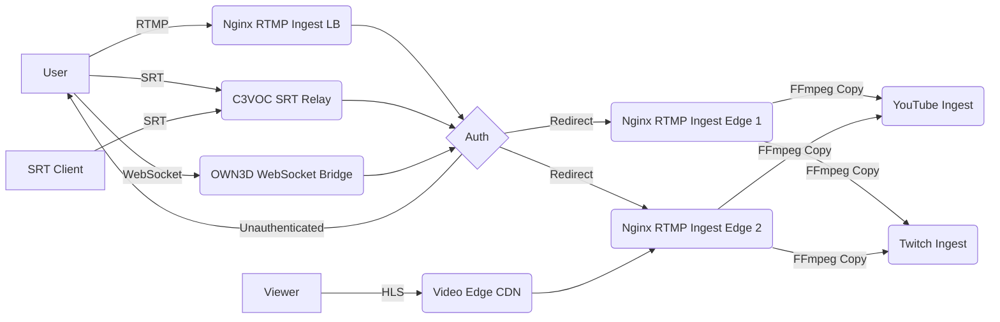

# Restreaming

StreamTV allows you to restream your live stream to multiple platforms at the same time. This feature is available for
all pro users.

## Infrastucture

The Restreaming feature is built on top of Nginx RTMP. The following diagram shows the basic architecture of
the Restreaming feature.



## API Endpoints

### Get Streams

Returns a list of all streams.

```http
GET /v1/streams
```

```json
{
  "data": [
    {
      "id": "9a8e3a6d",
      "user_id": "1",
      "name": "New Stream",
      "created_at": "2021-09-01T12:00:00Z",
      "updated_at": "2021-09-01T12:00:00Z",
      "restream_targets": [
        {
          "platform": "twitch",
          "platform_id": "106415581"
        },
        {
          "platform": "custom",
          "stream_url": "rtmp://a.rtmp.youtube.com/live2"
        }
      ]
    }
  ]
}
```

### Get Stream Keys

Returns a list of all stream keys for a specific stream.

Supported protocols are `rtmp`, `srt` and `websocket`.

> The WebSocket protocol is only available for StreamTV specific products.

```http
GET /v1/streams/{id}/stream-keys
```

```json
{
  "data": [
    {
      "protocol": "rtmp",
      "stream_key": "publish_9a8e3a6d_7jwEDAxdYwDjZeT4BNfu7K6g"
    },
    {
      "protocol": "srt",
      "stream_key": "publish/9a8e3a6d/7jwEDAxdYwDjZeT4BNfu7K6g"
    },
    {
      "protocol": "websocket",
      "stream_key": "publish_9a8e3a6d_7jwEDAxdYwDjZeT4BNfu7K6g"
    }
  ]
}
```

### Reset Stream Key

Resets the stream key for a specific stream.

Supported protocols are `rtmp` and `srt`.

```http
POST /v1/streams/{id}/stream-keys/reset
```

```json
{
  "protocol": "rtmp"
}
```

### Create Stream

Creates a new stream.

```http
POST /v1/streams
```

```json
{
  "name": "New Stream"
}
```

### Update Stream

```http
PUT /v1/streams/{id}
```

```json
{
  "name": "New Name"
}
```

### Delete Stream

```http
DELETE /v1/streams/{id}
```

### Watch a Stream

Returns all playlist urls for a specific stream.

```http
GET /v1/streams/{id}/playlists
```

```json
{
  "playlists": [
    {
      "protocol": "hls",
      "url": "https://video-edge.hls.stream.tv/streams/9a8e3a6d.m3u8"
    },
    {
      "protocol": "srt",
      "url": "srt://fsn1.ingest.stream.tv:1337?streamid=play/9a8e3a6d"
    }
  ]
}
```

### Create Restream Target

Creates a new Restream Target for a specific stream.

```http
GET /v1/streams/{id}/restream-targets
```

You either have to provide a `stream_key` or a `stream_url` and a `stream_key` for the Restream Target.

Option 1: For well known platforms like Twitch, YouTube, Facebook, etc. you can use the `platform` field.

Supported platforms are `twitch`, `youtube`, `kick`, `custom`.

```json
{
  "platform": "twitch",
  "stream_key": "live_106415581_xxxxxxxxxxxxxxxxxxxxxxxxxxxxxx"
}
```

Option 2: For custom platforms you can use the `stream_url` field.

```json
{
  "platform": "custom",
  "stream_url": "rtmp://a.rtmp.youtube.com/live2",
  "stream_key": "f0gh-mycg-xxxx-xxxx-xxxx"
}
```

### Update Restream Target

Deletes a Restream Target for a specific stream.

```http
PATCH /v1/streams/{id}/restream-targets/{id}
```

```json
{
  "name": "New Name"
}
```

### Delete Restream Target

Deletes a Restream Target for a specific stream.

```http
DELETE /v1/streams/{id}/restream-targets/{id}
```

### Get RTMP Ingest Server List

Returns a list of all available RTMP ingest servers (ordered by distance).

```http
GET /v1/ingests?protocol=rtmp
```

```json
{
  "ingests": [
    {
      "name": "Germany, Falkenstein",
      "region": "eu-central",
      "url_template": "rtmp://fsn1.ingest.stream.tv/app/{stream_key}",
      "priority": 1
    },
    {
      "name": "Finland, Helsinki",
      "region": "eu-central",
      "url_template": "rtmp://hel1.ingest.stream.tv/app/{stream_key}",
      "priority": 2
    },
    {
      "name": "USA, Hillsboro",
      "region": "us-west",
      "url_template": "rtmp://hil1.ingest.stream.tv/app/{stream_key}",
      "priority": 3
    },
    {
      "name": "USA, Ashburn",
      "region": "us-east",
      "url_template": "rtmp://ash1.ingest.stream.tv/app/{stream_key}",
      "priority": 4
    }
  ]
}
```

### Get SRT Ingest Server List

Returns a list of all available SRT ingest servers (ordered by distance).

```http
GET /v1/ingests?protocol=srt
```

```json
{
  "ingests": [
    {
      "name": "Germany, Falkenstein",
      "region": "eu-central",
      "url_template": "srt://fsn1.ingest.stream.tv:1337?streamid={stream_key}",
      "priority": 1
    }
  ]
}
```

### Get WebSocket Ingest Server List

Returns a list of all available WebSocket ingest servers (ordered by distance).

> This is an experimental feature and only available for StreamTV specific products.

```http
GET /v1/ingests?protocol=websocket
```

```json
{
  "ingests": [
    {
      "name": "Germany, Falkenstein",
      "region": "eu-central",
      "url_template": "wss://fsn1.ingest.stream.tv?stream_key={stream_key}",
      "priority": 1
    }
  ]
}
```